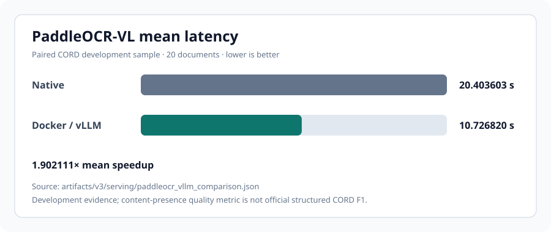
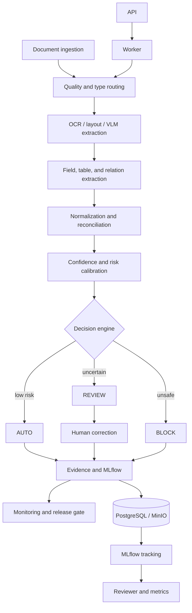
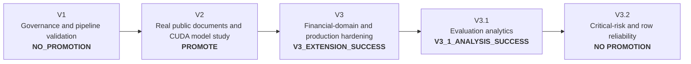
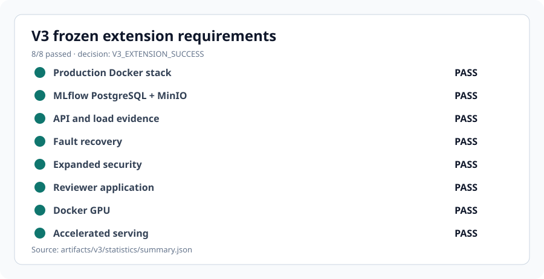
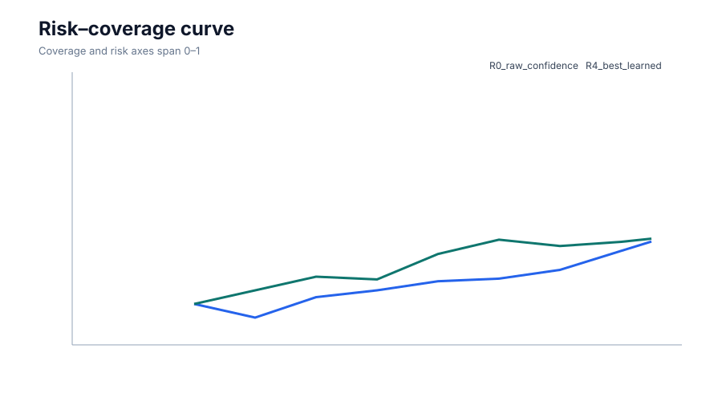
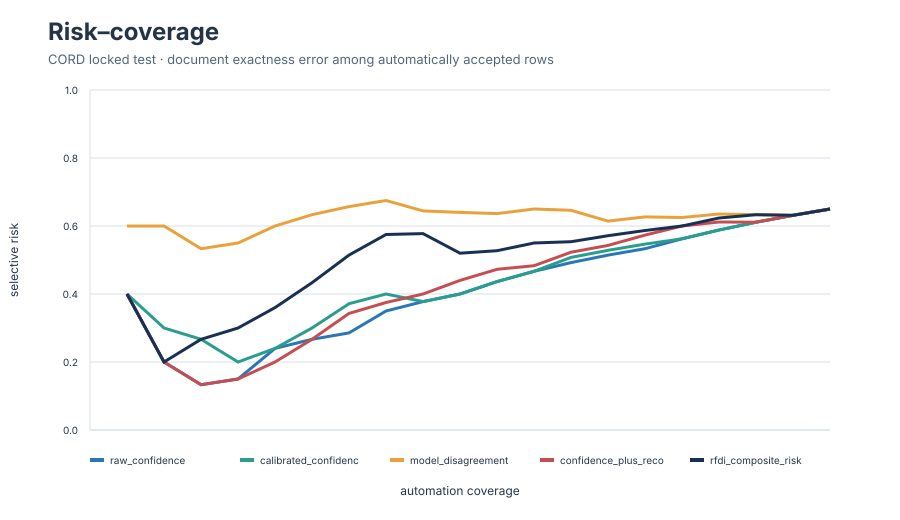
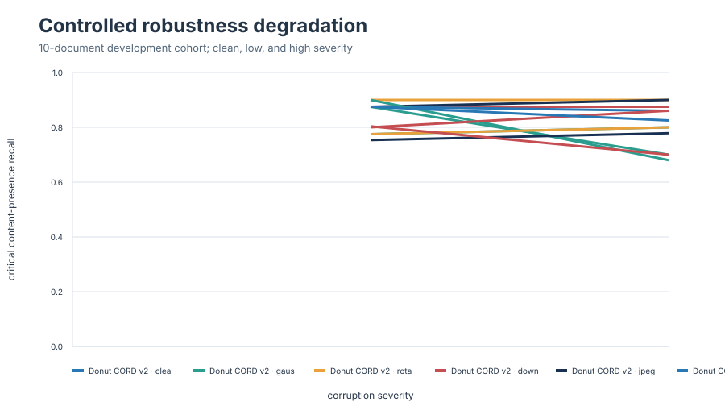

# R-FDI — Reliable Financial Document Intelligence

**Reliability-first OCR/VLM extraction with calibrated automation, reconciliation, audit provenance, and production-hardening evidence.**

[](https://github.com/ReviveCoding/reliable-financial-document-intelligence/actions/workflows/ci.yml)
[](https://github.com/ReviveCoding/reliable-financial-document-intelligence/releases/latest)

R-FDI is an evidence-governed research system for extracting and reconciling financial-document data while deciding when automation is safe. It combines OCR, layout models, vision-language models, normalization, financial consistency checks, calibrated routing, human review, fault studies, and reproducible evidence. This is a production-style research simulation using public and synthetic data—not a live bank deployment or a regulatory-compliance claim.

## Key measured results

| Study | Split / scope | Measured result | Evidence |
|---|---|---:|---|
| Donut on CORD | Locked test, 95 eligible receipts | Leaf F1 **0.8372**; total exact **0.9895** | [V2 release decision](artifacts/v2/release/decision.json) |
| PP-OCRv5 + rules on CORD | Same locked test | Total exact **0.4632** | [V2 release decision](artifacts/v2/release/decision.json) |
| Donut vs PP-OCRv5 + rules | Paired locked test | **+0.5263** total-exact improvement; bootstrap 95% CI **[+0.4316, +0.6211]** | [V2 release decision](artifacts/v2/release/decision.json) |
| LayoutLMv3 on FUNSD | Locked test, 50 documents | Macro-F1 **0.7009** | [V2 release decision](artifacts/v2/release/decision.json) |
| PaddleOCR-VL native | CORD development, 20 documents | Mean latency **20.403603 s**; content-presence recall **0.891889** | [Paired V3 result](artifacts/v3/serving/paddleocr_vllm_comparison.json) |
| PaddleOCR-VL Docker/vLLM | Same 20 development documents | Mean latency **10.726820 s**; recall **0.917128**; **1.902111×** mean speedup | [Paired V3 result](artifacts/v3/serving/paddleocr_vllm_comparison.json) |

The PaddleOCR-VL recall measure is canonical leaf-value content presence, not official structured CORD F1. Development results are labeled and were not used as locked-final evidence.



## System architecture



## Research and evidence lineage

V1, V2, and V3 answer different questions; later phases do not erase earlier negative evidence.



- **V1:** Can the governance, evaluation, risk, and audit pipeline fail closed? Its historical `NO_PROMOTION` result remains intact.
- **V2:** Which fixed model families work on authorized real public documents under locked evaluation? All ten predeclared gates passed for an offline research candidate.
- **V3:** Can the system demonstrate production-style runtime, persistence, recovery, reviewer, security, and accelerated-serving evidence? All eight frozen extension requirements passed.

## Modeling and baselines

The repository retains classical OCR/rules, PP-OCRv5, LayoutLMv3, Donut, PaddleOCR-VL, and Qwen3-VL studies. V2 fixed model families before locked evaluation, compared operationally important financial fields, and retained pilots, development results, final results, ablations, robustness, calibration, and model cards. Stronger baselines and negative results remain visible.

## Reliability methodology

R-FDI separates model extraction from deterministic controls: schema validation, normalization, subtotal/tax/total reconciliation, confidence and field-error risk, selective routing, idempotent state transitions, and immutable evidence manifests. Locked inputs are guarded against development-time tuning. Promotion follows frozen gates rather than post-hoc metric selection.

## Production runtime

V3 executed a real Docker Compose stack with FastAPI, worker, reviewer UI, Redis, PostgreSQL, MinIO, and MLflow. PostgreSQL directly retained MLflow run metadata and MinIO directly retained the matching artifact. The application currently uses a SQLite durable queue and filesystem object store; Redis persistence was validated independently but Redis is not represented as the active application transport.

## Benchmark results

- API/reviewer behavior: **7/7** checks passed, including idempotency, worker completion, review commit, HTML endpoints, and metrics.
- Preserved cached-route load: peak **26.6270 documents/s** with zero errors at evaluated concurrency levels.
- Corrected unique-input Donut GPU load: peak **0.8122 documents/s**. The earlier deduplicated benchmark is retained and explicitly invalid.
- V3 closure validation: **12/12** deterministic tests passed; **33** V3 evidence-manifest entries and all **206** V2 files were verified before the publication-only README update.



## Where the system works — and where it fails

### V3.2 critical-risk control

V3.2 leaves extractor weights unchanged and treats CORD test as a
`RETROSPECTIVE_LOCKED_BENCHMARK`, not a fresh holdout. Permutation-invariant
row matching raises line-item F1 from the historical flat **0.7887** to
**0.9534**, but row exact match is only **60.23%**, row-alignment failures affect
**10.0%**, and **41.0%** of documents contain at least one broadly defined
critical monetary error.

The strongest adequately supported retrospective slices are high sequence
confidence (N=33, **9.1%** critical-error rate), high resolution (N=26,
**30.8%**), and low predicted line-item count (N=40, **35.0%**). The weakest
are low sequence confidence (N=34, **76.5%**), high predicted line-item count
(N=20, **65.0%**), and high reconciliation residual (N=20, **55.0%**).

The best learned candidate, shallow gradient boosting R4, does not beat raw
confidence: retrospective AURC is **0.3314** versus **0.2356** (lower is
better). At 50% review, raw confidence captures **75.6%** of critical errors
but leaves **20.0%** critical risk among accepted documents. No 5%, 10%, or
20% finite-sample target is certified, so the frozen decision is
`V3_2_RISK_MODEL_NO_PROMOTION` and runtime routing remains unchanged.




See the [v3.2 final report](reports/v3_2/FINAL_REPORT.md) and
[executive findings](reports/v3_2/EXECUTIVE_FINDINGS.md).

### V3.1 slicing baseline

V3.1 analyzes frozen model evidence; it does not change model weights or tune on
the locked test. Donut's document-average CORD test leaf F1 is **0.8453** across
100 receipts (the separately retained micro leaf F1 is **0.8372**). The three
strongest adequately supported predeclared slices are low text density
(N=29, F1 **0.9208**, delta **+0.0756**), high image resolution (N=23, F1
**0.9029**, delta **+0.0576**), and medium document text length (N=39, F1
**0.8932**, delta **+0.0479**).

The three weakest are high text density (N=37, F1 **0.7485**, delta
**-0.0968**, FDR q=0.0242), high document text length (N=33, F1 **0.7566**,
delta **-0.0887**, q=0.0485), and high OCR-token count (N=31, F1 **0.7733**,
delta **-0.0720**, q=0.2154). The first two are statistically and practically
meaningful under the frozen protocol; the third is practically meaningful but
not FDR-significant.

Genuine Donut sequence confidence is severely overconfident: development-fit
isotonic calibration reduces locked-test ECE from **0.6330** to **0.1242**, but
does not improve selective ordering over raw confidence. Even at 50% review,
raw-confidence routing leaves an **18.0%** critical false-accept rate among
auto-accepted documents while capturing **76.9%** of critical-error documents;
none of the studied policies supports low-risk unattended automation. In the
10-document development robustness cohort, Donut's largest critical-content
loss is high occlusion (**-0.2200**), followed by high Gaussian blur
(**-0.2000**). These robustness findings are descriptive, not locked-final.





See the [full v3.1 analysis report](reports/v3_1/FINAL_ANALYSIS_REPORT.md) and
[executive findings](reports/v3_1/EXECUTIVE_FINDINGS.md).

## GPU-accelerated serving

PaddleOCR-VL 1.6 ran through Docker/vLLM on one NVIDIA GeForce RTX 4090 Laptop GPU. The bounded server completed 20/20 HTTP inference requests, kept **35.51%** measured VRAM headroom at maximum observed use, and achieved the paired development result shown above. No CPU fallback, concurrent GPU job, or multi-GPU claim is made.

## Security and fault-recovery evidence

The 24-case adversarial-document benchmark preserved every untrusted-input boundary and exposed no unauthorized action capability. Its regex detector activated on 20/24 cases; homoglyph and split-word misses plus benign triggers are explicitly retained, so detection is not presented as prompt-injection immunity. The seven-case local executable fault study passed **7/7**. Redis, PostgreSQL, and MinIO stop/restart probes passed **3/3**, including cross-store MLflow recovery.

## Repository structure

| Path | Purpose |
|---|---|
| `src/rfdi/` | Core schemas, extraction, normalization, reconciliation, risk, routing, and state logic |
| `src/rfdi_v3/` | Durable V3 runtime and security boundary controls |
| `services/` | API, worker, reviewer, and model-serving entry points |
| `configs/` | Frozen experiment gates and Docker/vLLM configuration |
| `tests/` | Deterministic CPU tests and locked-data guards |
| `artifacts/` | Compact measured evidence, tables, statistics, and figures |
| `reports/` | Technical reports, access decisions, limitations, and reproduction notes |
| `scripts/` | Evidence verification and explicitly scoped experiment runners |

## Reproduction and quick start

The deterministic validation path requires Python 3.10 and no GPU framework:

```bash
git clone https://github.com/ReviveCoding/reliable-financial-document-intelligence.git
cd reliable-financial-document-intelligence
python -m compileall -q src scripts tests
PYTHONPATH=src python -m unittest discover -s tests -v
python scripts/verify_evidence.py
python scripts/verify_v2_committed_evidence.py
python scripts/v3/verify_evidence.py
python scripts/v3_1/verify_evidence.py
python scripts/v3_2/verify_evidence.py
```

Full-data V2 verification additionally hashes the authorized locked CORD, FUNSD,
and synthetic inputs and therefore requires those local datasets:

```bash
python scripts/v2_verify_evidence.py
```

For Docker runtime and authorized GPU reproduction, follow the [V3 reproducibility guide](reports/v3/REPRODUCIBILITY.md) and [runbook](docs/RUNBOOK.md). Do not rerun locked-final experiments for tuning.

## Evidence governance

Every phase maintains workflow state, experiment registries, decisions, blockers, and hash-based evidence manifests. V1 remains `NO_PROMOTION`; V2 is `PROMOTE` only within its offline research scope; V3 is `V3_EXTENSION_SUCCESS`; v3.1 is `V3_1_ANALYSIS_SUCCESS`; and v3.2 is `V3_2_RISK_MODEL_NO_PROMOTION`. Verification scripts independently recompute hashes and decision logic.

## Limitations

- This is not a live bank production deployment or evidence of regulatory certification.
- PaddleOCR-VL serving numbers are a 20-document development comparison using content-presence recall, not official CORD F1.
- Redis is not the current application queue transport; Compose credentials are local-development defaults and are unsuitable for production.
- DocILE and REFinD require human-authorized access. Textract was not run because no positive AWS budget and valid credentials were established.
- Only one physical GPU was used. Raw datasets, model weights, runtime caches, and credentials are not committed.

## Further work

Implement an actual Redis-backed queue adapter, broaden paired serving trials, evaluate official structured metrics after authorized dataset access, harden secrets and network policy for deployment, add observability over longer soak tests, and validate drift and calibration under new institutions and document templates.

## Research reports and important artifacts

- [V3 final report](reports/v3/FINAL_REPORT.md) · [V3 infrastructure/runtime](reports/v3/INFRASTRUCTURE_AND_RUNTIME.md) · [V3 accelerated serving](reports/v3/PADDLEOCR_VLLM_SERVING.md) · [V3 security](reports/v3/SECURITY_BENCHMARK.md)
- [V3.2 final report](reports/v3_2/FINAL_REPORT.md) · [V3.2 row evaluation](reports/v3_2/ROW_AWARE_LINE_ITEM_EVALUATION.md) · [V3.2 certification](reports/v3_2/RISK_CERTIFICATION.md)
- [V3.1 final analysis](reports/v3_1/FINAL_ANALYSIS_REPORT.md) · [V3.1 executive findings](reports/v3_1/EXECUTIVE_FINDINGS.md)
- [V2 final technical report](reports/v2/FINAL_TECHNICAL_REPORT.md) · [V2 release decision](artifacts/v2/release/decision.json) · [V2 model comparison](artifacts/v2/tables/model_comparison.csv)
- [V1 final technical report](reports/FINAL_TECHNICAL_REPORT.md) · [V1 final status](FINAL_STATUS.md)
- [V3 workflow state](V3_WORKFLOW_STATE.json) · [V3 evidence manifest](V3_EVIDENCE_MANIFEST.jsonl) · [V3 blockers](V3_BLOCKERS.md)
