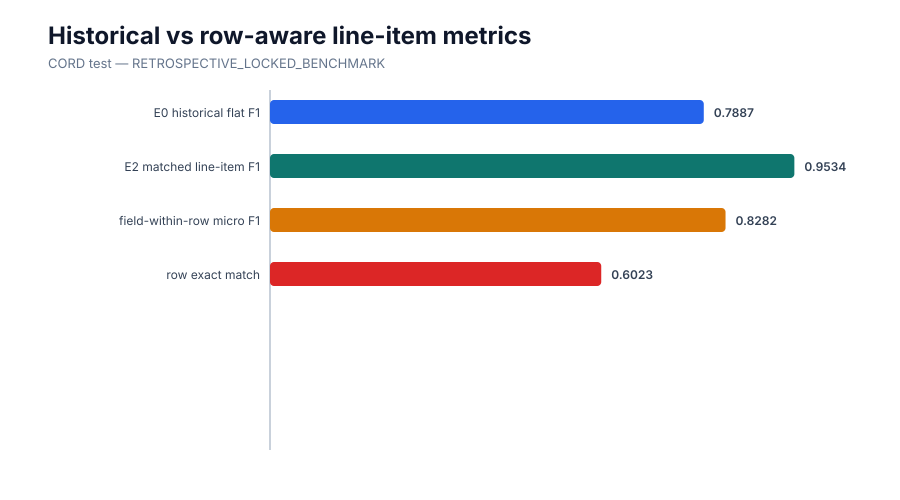

# Corrected row-aware line-item evaluation

| Scope | E0 path-occurrence field F1 | E1 positional-row field F1 | E2 matched-row F1 | E2 matched-field micro F1 | E2 row exact |
|---|---:|---:|---:|---:|---:|
| Development replay | 0.8523 | 0.8504 | 0.9662 | 0.8727 | 0.6154 |
| Retrospective CORD | 0.8016 | 0.7887 | 0.9534 | 0.8585 | 0.6023 |

Matched-row F1 measures whether rows are matchable; matched-field F1 measures content within those matched rows. They are not interchangeable. Retrospective benign permutation-only rate is 0.0%; semantic association error is 10.0%; missing-row and spurious-row document rates are 6.0% and 10.0%. Fifteen synthetic cases validate these distinctions.

